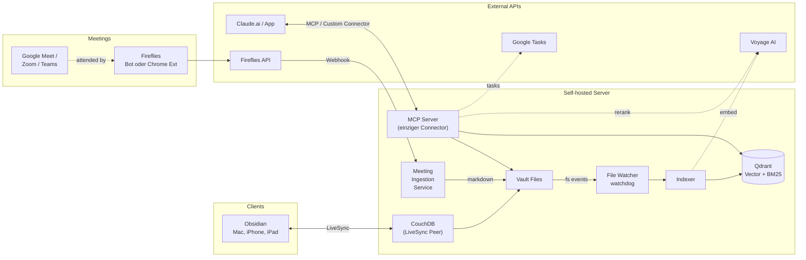

# Second Brain – Architektur, Roadmap & Build Prompts

## TL;DR

Selbst-gehostetes persistentes Gedächtnis für Claude. **Obsidian** = Source of Truth, **Voyage AI** = Embeddings & Reranking, **Qdrant** = Vector Store, **eigener MCP Server** verbindet alles mit Claude.ai. **Fireflies** liefert Meeting-Transcripts ausschließlich per Webhook ins Vault (kein zweiter MCP-Connector). **People-Layer** lernt aus Meetings die Gesprächspartner. **Google Tasks** im selben MCP konsolidiert. Kern-Pattern: **Living Documents** pro Projekt und pro Person.

**Was es nicht ist:** Kein CRM-Mirror, keine n8n-Workflow-Engine, kein HubSpot-Sync, kein zweiter Connector. Eine Schnittstelle Claude ↔ unser MCP, fertig.

---

## Inhaltsverzeichnis

1. Architektur-Diagramm
2. Komponenten
3. Living Documents Pattern
4. People Layer
5. Datenflüsse
6. Conversation-Flow
7. MCP Tool Specification
8. Phasen-Roadmap
9. Tech-Stack
10. Offene Punkte
11. Nächster Schritt

---

## 1. Architektur-Diagramm



Eine Schnittstelle in Claude.ai. Fireflies bleibt reine Datenquelle hinter dem Webhook.

---

## 2. Komponenten

### 2.1 Obsidian Vault

```
00_Inbox/        Schnelles Capture
10_Projects/     Aktive Projekte (Living Docs)
20_Areas/        Verantwortungsbereiche
30_Resources/    Themen-Wissen
40_Archive/      Abgeschlossen
50_Daily/        Daily Logs + meetings/ Subordner
60_MOCs/         Maps of Content
70_People/       Person-Living-Docs
99_Meta/         Templates, Konventionen
```

### 2.2 Sync Layer

Self-hosted LiveSync (CouchDB) – Plugin `obsidian-livesync`, Server bekommt Files direkt.

### 2.3 Ingestion Pipeline

Python 3.12, watchdog, voyageai, qdrant-client. Markdown-aware Chunking nach Headings, Sliding Window für lange Sektionen, Hash-basierte Idempotenz. `voyage-context-3` zum Embedden, `voyage-3.5` für Queries, `rerank-2.5` zum Reranken.

### 2.4 Vector Store – Qdrant

Hybrid-Search (Sparse-BM25 + Dense). Payload mit `path`, `type`, `project`, `status`, `tags`, `headings`, `attendees`.

### 2.5 MCP Server (einziger Connector)

Python + FastMCP, Docker, Caddy mit TLS und Bearer-Auth. Tool-Gruppen: **Vault**, **People**, **Google Tasks**.

### 2.6 Meeting Ingestion Service

Starlette-Route auf dem MCP-Server (`POST /fireflies/webhook`). Verifiziert die HMAC-Signatur, holt das Transcript per GraphQL, mappt Speaker via Calendar+Summary auf echte Namen, rendert Markdown und schreibt ins Vault. Watcher übernimmt von dort.

### 2.7 Claude.ai Integration

Ein Custom Connector → `https://mcp.<domain>/mcp` (Streamable HTTP), Bearer Auth.

---

## 3. Living Documents Pattern

Pro aktivem Projekt eine Living Note in `10_Projects/`. Claude liest sie zu Conversation-Beginn, ergänzt sie strukturiert. On-Demand-Modus: *„merk dir das"* triggert Append; ohne Projektbezug → Session-Note in `50_Daily/`.

---

## 4. People Layer

Pro relevanter Person eine Living Note in `70_People/`. Speaker aus Meeting-Transcripts werden per E-Mail (bevorzugt) oder Fuzzy-Name auf existierende Person-Notes gemappt. Bei Match: `last_interaction` aktualisieren, History-Eintrag mit Wikilink ans Meeting. Bei No-Match: in `unrecognized_attendees:` der Meeting-Note – Claude schlägt später Anlage vor.

**Datenschutz-Konvention (DSGVO):** Notiert wird beruflicher Kontext und freiwillig Geteiltes. Keine besonderen Kategorien nach Art. 9 (Gesundheit, politische/religiöse Ansichten, sexuelle Orientierung, ethnische Herkunft, Gewerkschaft). Auskunftsrecht: Vault ist durchsuchbar. Aufbewahrung: bei Beziehungsende Archive oder Löschen. Detaillierte Doku in `99_Meta/DSGVO-People-Convention.md`.

---

## 5. Datenflüsse – Übersicht

| Flow | Wann | Tools |
|---|---|---|
| Indexing | Datei-Änderung | Watcher → Voyage → Qdrant |
| Conversation Start | „Lass uns über X reden" | `get_living_doc` / `get_person` |
| RAG Query | Wissensfrage | `search_notes` + Filter |
| Insight speichern | „merk dir das" | `append_to_living_doc` |
| Person-Update | „Anna ist jetzt VP" | `append_to_person` + Frontmatter-Update |
| TODO erfassen | „füg das als Aufgabe hinzu" | `create_task` + Living Doc |
| Meeting eingeht | Nach Meeting-Ende | Fireflies → Webhook → Ingestion → Vault |

---

## 6. Phasen-Roadmap

| Phase | Inhalt | Aufwand |
|---|---|---|
| **0** | Vault Skeleton (Struktur, Templates, Konventionen) | 1 Tag |
| **1** | Sync + Ingestion (LiveSync, Indexer, Watcher) | 2–3 Tage |
| **2** | MCP Server MVP (Read-Tools für Vault & People) | 1–2 Tage |
| **3** | Write-Layer + Quality (Hybrid Search, Rerank, Write-Tools) | 2–3 Tage |
| **4** | Google Tasks (OAuth2, Tools, Living-Doc-Mapping) | 1–2 Tage |
| **5** | Fireflies Integration (Webhook, GraphQL-Fetch, Speaker-Resolver, Renderer) | 2–3 Tage |
| **6** | Optional Polish (find_related, Multimodal, Bootstrap) | laufend |

---

## 7. Tech-Stack-Entscheidungen

| Komponente | Wahl |
|---|---|
| Editor | Obsidian + LiveSync Plugin |
| Sync | CouchDB (Self-hosted LiveSync) |
| Embedding | voyage-context-3 (index) + voyage-3.5 (query) |
| Reranker | rerank-2.5 |
| Vector DB | Qdrant (Hybrid Search) |
| MCP Framework | FastMCP (Python) |
| Watcher | watchdog |
| Tasks-API | Google Tasks REST + OAuth2 |
| Meeting-Tool | Fireflies (Webhook-only) |
| Hosting | Docker auf Self-hosted Server |
| Reverse Proxy | Caddy (auto-TLS) |

---

## 8. Offene Punkte

1. **Konflikt-Handling Living Doc** bei parallelen Edits → Lock + mtime-Check (Phase 3).
2. **Bootstrap der Living Docs** aus `recent_chats` → Phase 6.
3. **Speaker-Matching-Edge-Cases** (gleiche Vornamen) → fuzzy-Threshold + manuelle Bestätigung.
4. **HubSpot-Bridge bei Personen**: optionales Frontmatter-Feld, kein Auto-Sync.
5. **Re-Indexing-Strategie** bei Voyage-Modellwechsel.
